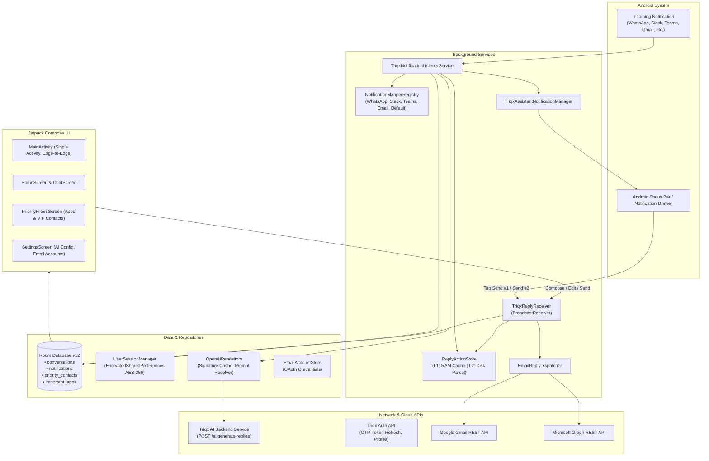

# Triqx — Intelligent AI Communication Assistant & Smart Notification Hub
## Executive & Technical Project Write-Up

---

### 1. Executive Summary

**Triqx** is an intelligent, AI-powered Android communication assistant designed to eliminate notification overload, app-switching fatigue, and communication delays. Modern professionals receive dozens of messages across disparate channels every hour—WhatsApp, Microsoft Teams, Slack, Telegram, Gmail, and Outlook. Filtering what matters, context-switching between multiple apps, and drafting replies consumes significant time and mental bandwidth.

Triqx transforms the Android device into a centralized, context-aware command center:
1. **Intelligently filters incoming messages** so that only priority contacts (VIPs) and mission-critical applications are surfaced.
2. **Generates real-time, context-aware AI smart replies** the instant a message arrives.
3. **Executes 1-stage headless replies** directly from the Android notification shade or the Triqx unified inbox—**without opening the source messaging applications**.
4. **Integrates natively with major email platforms** (Gmail and Outlook) using official OAuth 2.0 APIs for true background email replies.

---

### 2. The Problem & Business Value

| The Problem | How Triqx Solves It | Business / User Value |
| :--- | :--- | :--- |
| **Notification Fatigue**: Dozens of low-priority pings obscure critical messages from managers, clients, and family. | **Priority Filter Engine**: Whitelists select "Important Apps" and "Priority Contacts" (VIPs). Noise is filtered out; VIP communications are prioritized. | Eliminates distraction; ensures critical communications are never missed. |
| **App-Switching Overhead**: Replying requires switching between WhatsApp, Teams, Slack, Outlook, and Gmail constantly. | **Unified Headless Dispatch**: Sends replies directly via Android `RemoteInput` or Cloud APIs without launching the target app. | Reduces context switching; saves 15–30 seconds per message response. |
| **Repetitive Typing**: Routine acknowledgments and scheduling messages must be manually typed repeatedly. | **Contextual AI Smart Replies**: Triqx automatically analyzes conversation threads and generates 3–5 instant response options. | Instant 1-tap responses; faster reaction times to urgent inquiries. |
| **One-Size-Fits-All Replies**: Default OS suggestions are generic and lack context or appropriate tone. | **3-Tiered Prompt Merging**: Prompts can be customized globally, per-application (e.g., Slack = Professional), and per-conversation (e.g., Client = Formal). | Delivers personalized, brand- and relationship-appropriate replies. |

---

### 3. Core Capabilities: "What It Does"

#### 1. Real-Time Notification Interception & Parsing
Triqx runs a low-overhead background `NotificationListenerService` that intercepts system notifications. Instead of treating notifications as plain text strings, Triqx executes modular, app-specific parsers to deconstruct notifications into rich conversation threads.
* **Supported Apps**: WhatsApp & WhatsApp Business, Microsoft Teams, Slack, Telegram, Gmail, Outlook, and generic fallback for any messaging app.
* **Smart Detection**: Handles synthetic messages (e.g., *"⤷ You got a reply"* in WhatsApp), distinguishes between "You" and group members, and extracts senders, receivers, and subject lines.

#### 2. VIP Contacts & Important Apps Filtering
Users maintain granular control over what reaches their priority feed:
* **Priority Contacts (VIPs)**: Linked directly from the device's address book or created manually with custom aliases, multiple phone numbers, and email addresses.
* **Important Apps**: Applications whitelisted by the user to allow notifications through.
* **Strict Privacy Guard**: Notifications that belong neither to an important app nor to a priority contact are discarded from AI generation and conversation indexing.

#### 3. Real-Time AI Smart Reply Generation
As soon as a priority notification is received, Triqx constructs a chronological conversation payload and queries the Triqx AI backend service.
* Generates 1 to 5 context-appropriate reply options within milliseconds.
* Uses smart caching and fingerprinting: if an identical message has already been processed, it returns cached suggestions immediately.
* Auto-cancels obsolete in-flight generation requests if a newer incoming message arrives before generation completes.

#### 4. Interactive "Triqx AI Assistant" Notification Shade
Triqx injects its own high-priority assistant notification directly into the Android notification drawer:
* Displays a compact 2-line summary of the incoming message.
* Presents AI-suggested responses directly in the notification body.
* Provides **1-tap numbered action buttons** (`1️⃣ Send #1`, `2️⃣ Send #2`, `3️⃣ Send #3`) and an **inline `✏️ Edit` button** with Android `RemoteInput`.
* Tapping a numbered button sends the reply in the background and dismisses the notification.

#### 5. Headless 1-Stage Reply Dispatch
Triqx can send responses without launching the third-party application:
* **Chat Apps (WhatsApp, Teams, Slack, Telegram)**: Dispatches replies by injecting text into the intercepted `RemoteInput` slots and firing the associated `PendingIntent`.
* **Resilient Two-Tier Storage (L1 RAM + L2 Disk)**: Marshals Android `Notification.Action` parcels into Base64 strings in persistent disk storage. Even if the device reboots or the app process is terminated, reply capability is preserved.

#### 6. Native Email API Integration (Gmail & Outlook)
For email applications where Android `RemoteInput` is frequently absent or stripped, Triqx provides direct cloud API integration:
* **OAuth 2.0 Authentication**: AppAuth-based sign-in for Google (Gmail API) and Microsoft Entra ID (Microsoft Graph API).
* **Multi-Account Support**: Connects multiple Gmail and Outlook accounts simultaneously.
* **Polymorphic Dispatcher**: Automatically detects the destination address and dispatches replies via the correct account's official REST API in the background.

#### 7. 3-Tier Multi-Layer Prompt Architecture
AI reply personality and behavior can be configured at three distinct levels, which dynamically merge at runtime:
1. **Global Settings Prompt**: System-wide behavior (e.g., *"Keep all replies under 15 words"*).
2. **App-Level Prompt & Reply Style**: Custom tone per platform (e.g., *"Professional and concise"* for Slack, *"Casual"* for WhatsApp).
3. **Conversation-Level Prompt Override**: Specific instructions for a single contact or group (e.g., *"Always reply in German"* or *"Offer 5 options instead of 3"*).

#### 8. Unified Chat & Inbox UI
A modern, unified messaging interface that lets users view conversation threads from all apps in one place, edit replies before sending, customize conversation-specific AI prompts, and perform search and filtering.

#### 9. Secure Phone OTP Authentication & Profile Onboarding
A production-ready mobile authentication flow featuring international country code selection, OTP verification, secure token issuance, silent background token refresh, and encrypted profile management.

---

### 4. Technical Architecture: "How It Does It"

Triqx is built adhering to **Clean Architecture** principles, **MVVM (Model-View-ViewModel)** design patterns, and **Unidirectional Data Flow (UDF)**.



---

### 5. Detailed Component Breakdown

#### A. Notification Ingestion & Mapping Subsystem
* **`TriqxNotificationListenerService`**:
  * Extends Android's `NotificationListenerService`.
  * Filters out summary/group placeholder notifications (`FLAG_GROUP_SUMMARY`).
  * Extracts metadata: package, title, text, big text, messaging style bundle, contact lookup URIs, and sender emails.
  * Cross-references the database for VIP contact matches (by name, phone number, or email).
  * Stores a full JSON diagnostic snapshot in the `notifications` table for debugging.
* **`NotificationMapperRegistry` & Mappers**:
  * Uses the Strategy Pattern to select the appropriate parser (`WhatsAppNotificationMapper`, `TeamsNotificationMapper`, `SlackNotificationMapper`, `TelegramNotificationMapper`, `EmailNotificationMapper`, and `DefaultNotificationMapper`).
  * Normalizes disparate notification structures into a unified `ParsedNotification` data model containing `conversationTitle`, `individualSender`, `bodyText`, `chatTag`, and `isFromYou`.

#### B. The Resilient Reply Action Store (`ReplyActionStore`)
* Standard Android notification actions contain `RemoteInput` and `PendingIntent` objects that are garbage collected when notifications are dismissed or the app process is recycled.
* Triqx solves this using a **Two-Tier Storage Architecture**:
  * **L1 Cache**: In-memory `ConcurrentHashMap<String, Notification.Action>` offering sub-millisecond lookups.
  * **L2 Cache**: Serializes the `Notification.Action` into Android `Parcel` bytes, encodes to Base64, and writes to private storage.
  * On app launch or service restart, reply actions are restored into memory, enabling users to send replies to conversations even after the original notification was dismissed from the drawer.

#### C. AI Generation Pipeline & Multi-Tier Prompt Engine
* **`OpenAiRepository`**:
  * Computes a deterministic `messageSignature` (`sender|body|timestamp`) for the latest message in a conversation.
  * Evaluates cache: skips redundant API calls if replies already exist for the current signature.
  * **Active Job Debouncing**: Maintains an active job registry (`activeJobsByGroup`). If a new notification arrives while an AI request is in-flight for that same conversation, the stale request is cancelled immediately.
* **Multi-Tier Prompt Resolver (`resolveMergedPrompt`)**:
  * Combines three prompt layers into a coherent instruction set:
    $$\text{Final Prompt} = \text{Global Prompt} \oplus \text{App-Specific Prompt} \oplus \text{Conversation Prompt}$$
  * Transmits the conversation history (up to 10 latest messages), contact context, reply count, and resolved prompt to `BackendAiService`.
* **Offline Resilience**:
  * If the network is unavailable or the backend fails, an intelligent heuristic fallback engine generates relevant default responses based on message intent (questions, arrival updates, acknowledgments, greetings).

#### D. Reply Dispatch & Fallback Strategy Matrix
When a user triggers a reply—either from the notification shade button, inline edit, or the in-app chat screen—Triqx executes a multi-tiered dispatch strategy:

```
[User Triggers Reply]
         │
         ▼
Is it an Email App with a Connected Account?
  ├── YES ──► Dispatch via Gmail API / Microsoft Graph API ──► [Success]
  │                                                                 │ (If API fails)
  └── NO                                                            ▼
         │                                               Try RemoteInput Action
         ▼                                                          │
Has RemoteInput Action in ReplyActionStore?                        │
  ├── YES ──► Inject Text into RemoteInput & Fire PendingIntent ────┤
  │                                                                 │ (If Intent fails)
  └── NO                                                            ▼
         │                                               Execute Fallback Chain:
         ▼                                               1. ACTION_SENDTO Intent
Execute Fallback Chain                                    2. Copy to Clipboard + Launch App
```

#### E. Email Integration Subsystem (`EmailReplyDispatcher`)
* Implements a unified `EmailService` interface for `GmailEmailService` and `OutlookEmailService`.
* **Gmail**: Constructs RFC 2822 standard email payloads (Subject, In-Reply-To, References, Body), encodes them in URL-safe Base64, and dispatches via the Google Gmail REST API (`/gmail/v1/users/me/messages/send`).
* **Outlook**: Constructs JSON payloads formatted for the Microsoft Graph API (`/v1.0/me/sendMail`).
* **Multi-Account Resolver**: Automatically resolves whether the incoming message was received on Account A or Account B, ensuring replies originate from the correct email address.

#### F. Local Persistence & Room Database
* **Database Version**: 12 (SQLite via Android Room).
* **Entities**:
  1. `ConversationEntity`: Pre-aggregated, chronological conversation chains with custom AI prompt overrides.
  2. `NotificationEntity`: Raw notification log, used for diagnostic analysis and audit history.
  3. `ContactEntity`: Priority contacts with lookup keys, phone numbers, and emails.
  4. `AppEntity`: Important apps with custom reply styles and prompts.
  5. `EmailAccountEntity`: Connected email accounts and OAuth token metadata.

#### G. Security & Session Management (`UserSessionManager`)
* Auth tokens and profile metadata are encrypted at rest using **`EncryptedSharedPreferences`** backed by the hardware **Android Keystore** using **AES-256 GCM** encryption and **AES-256 SIV** key management.
* **Silent Token Refresh**: If an API call receives an HTTP 401 Unauthorized, the `BackendAiService` triggers an automatic, silent token refresh and retries the request transparently.
* **Zero-Footprint Sign Out**: A complete wipe sequence removes all Room database tables, user session tokens, email OAuth credentials, serialized reply actions, and AI caches from the device.

---

### 6. Technology Stack & Dependencies

| Category | Technologies / Libraries |
| :--- | :--- |
| **Language** | Kotlin 100% (target JVM 11) |
| **SDK Versions** | `minSdk = 29` (Android 10), `targetSdk = 37`, `compileSdk = 37` |
| **UI Framework** | Jetpack Compose (Material 3 Expressive Design, Compose Navigation, Coil) |
| **Visual Styling** | Glassmorphism & Liquid Blurs via `dev.chrisbanes.haze:haze:1.3.1` |
| **Architecture** | MVVM, Clean Architecture, Unidirectional Data Flow |
| **Concurrency** | Kotlin Coroutines (`SupervisorJob`, `Dispatchers.IO`), `StateFlow`, `SharedFlow` |
| **Dependency Injection** | Dagger Hilt with KSP (`dagger.hilt.android`, `androidx.hilt.navigation.compose`) |
| **Local Storage** | Android Room Database (`androidx.room:room-ktx`), Room TypeConverters |
| **Security** | Android Keystore, `androidx.security:security-crypto:1.1.0` (AES-256 GCM) |
| **Networking** | OkHttp 3, Gson, RESTful APIs |
| **Authentication** | AppAuth (`net.openid:appauth`), Google Play Services Auth, Custom Phone OTP |

---

### 7. Key Accomplishments & Current Status

* [x] **Full Notification Pipeline Operational**: Intercepts, parses, and thread-groups notifications across WhatsApp, Teams, Slack, Telegram, Gmail, and Outlook.
* [x] **AI Smart Replies**: Live integration with Triqx Backend AI service with sub-second generation, signature-based caching, and debouncing.
* [x] **1-Stage Headless Replies**: Functional for all supported messaging platforms using persisted `RemoteInput` actions.
* [x] **Notification-Shade Assistant**: Live notifications with interactive action buttons and inline text editing.
* [x] **Email Integration**: OAuth 2.0 connected flow and polymorphic dispatch for both Gmail and Microsoft Outlook.
* [x] **Multi-Tier Prompt Customization**: Global, per-app, and per-conversation prompt merging fully functioning.
* [x] **Mobile Auth Flow**: End-to-end OTP authentication, country picker, user profile setup, and secure token lifecycle.
* [x] **Modern UI**: Full Jetpack Compose interface with Material 3 Expressive components, dark/light theme support, and responsive layouts.

---

### 8. Potential Next Steps & Future Roadmap

1. **On-Device AI Inference**: Integrate Google Gemini Nano (AICore) for local on-device smart reply generation when offline.
2. **Wear OS Companion**: Extend quick reply triggers to smartwatches.
3. **Advanced Scheduling**: Allow users to schedule replies (e.g., *"Send at 9:00 AM tomorrow"*).
4. **Expanded Enterprise Connectors**: Add direct API integrations for Jira, Zendesk, and Linear notification handling.
